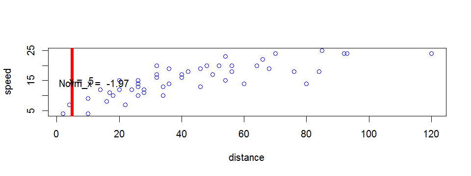

What is the ShinyApp "Cars Data Plot" for?
========================================================
- Maybe you need a normalized distance value to compare between different coordinate systems.
- The easy refference red vertical line makes it easy to find your original distance value and the related speed.

--- .class #id


Who is this ShinyApp for?
========================================================

- Anyone needing to quickly move between coordinate systems
- Navigators
- Cartographers
- Airline Pilots

--- .class #id

How does the ShinyApp "Cars Data Plot" work?
=======================================================


```r
plot(cars$dist,cars$speed,xlab='distance',ylab='speed',col='blue')
      x <- input$x
      lines(c(x, x), c(0, 200),col="red",lwd=5)
    norm <- (x-mean(cars$speed))/sd(cars$speed)
      text(8, 15, paste("x = ", x))
      text(12, 14, paste("Norm_x = ", round(norm, 2)))
```


 

--- .class #id


The ShinyApp "Cars Data Plot" Available at:
========================================================
- Deployed at [https://scotshields.shinyapps.io/Deploy/](https://scotshields.shinyapps.io/Deploy/)
- Code available at: [https://github.com/scotsditch/DevelopingDataProducts.git](https://github.com/scotsditch/DevelopingDataProducts.git)

--- .class #id


